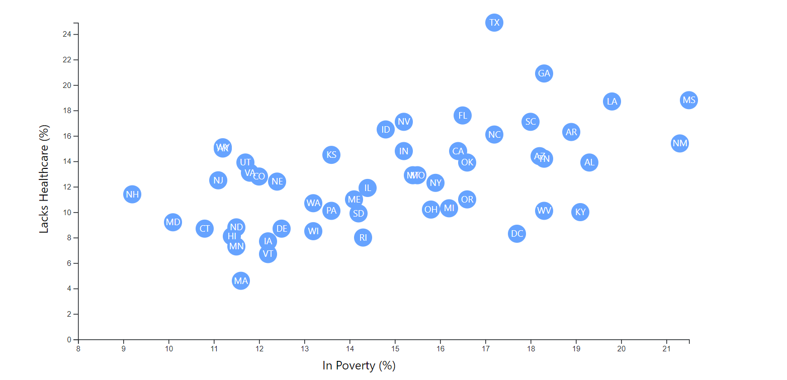

# Creating a Scatter Plot with D3.js
Given 2014 ACS 1-year estimate data from the US Census Bureau, a scatter plot was created to visualize the percentage of state populations in poverty vs the percentage of state populations that lack healthcare. 

